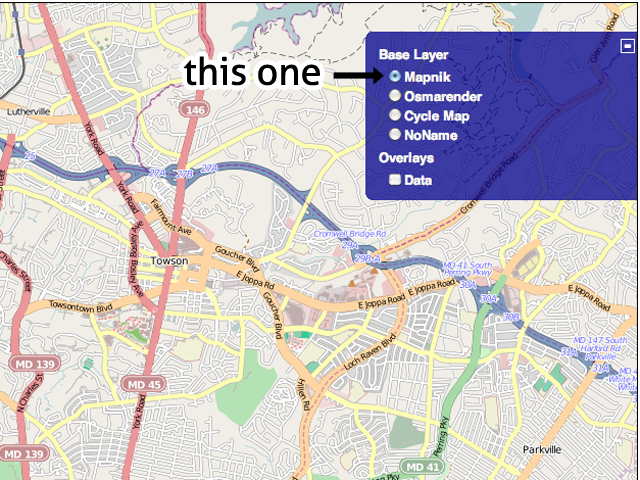
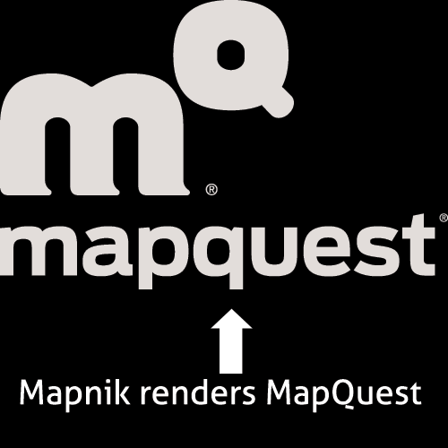

!SLIDE bullets
* mapmaking is complicated and difficult

!SLIDE center
# beautiful maps even without AJ?

!SLIDE center
* OSM/CSVs -> Shapefiles
* ...
* Cascadenik or Mapnik XML -> TileLite to preview
* ...
* Finished stylesheet -> TileCache to generate tiles
* ...
* Tiles -> S3 to serve tiles
* ...
* S3 -> OpenLayers to view tiles on the web

!SLIDE bullets
* What the heck are projections?
* Why is a shapefile three files?
* It costs that much?

!SLIDE bullets
* and installing all of that stuff.

!SLIDE center
# we didn't buy: we built

!SLIDE center
# and open source was already awesome

!SLIDE center
### Mapnik Renders Our Maps

!SLIDE center

!SLIDE center

!SLIDE center
### Styling

!SLIDE bullets
* plus *node.js*, *backbone.js*, *sqlite*, *openlayers*, *jquery*, *express*, *s3*, *wax*, and more.
* and hot sauce

!SLIDE
# TileMill

!SLIDE bullets
* Take a spin in TileMill

!SLIDE bullets
# Carto!
* Space-age CSS for maps

!SLIDE bullets

    #world {
        polygon-fill: #f00;
    }

!SLIDE bullets

    #world[zoom > 5] {
        polygon-fill: #f00;
    }

!SLIDE bullets

    #world[zoom > 5] {
        [NAME="United States"] {
            polygon-fill: #f00;
        }
        polygon-fill: #00f;
    }
 
!SLIDE bullets

    #world[zoom > 5] {
        [NAME="United States"] {
            polygon-fill: #f00;
        }
        polygon-fill: #00f;
    }
    .streets {
        line-width: 1;
    }

!SLIDE bullets

    @red: #f00;
    #world[zoom > 5] {
        [NAME="United States"] {
            polygon-fill: @red;
        }
        polygon-fill: @red + #222;
    }
    .streets {
        line-width: 1;
    }

!SLIDE bullets
* And there are a few other options

!SLIDE bullets
background-color,background-image,srs,buffer,font-directory,polygon-fill,polygon-gamma,polygon-opacity,polygon-meta-output,polygon-meta-writer,line-color,line-width,line-opacity,line-join,line-cap,line-gamma,line-dasharray,line-meta-output,line-meta-writer,marker-file,marker-opacity,marker-line-color,marker-line-width,marker-line-opacity,marker-placement,marker-type,marker-width,marker-height,marker-fill,marker-allow-overlap,marker-spacing,marker-max-error,marker-transform,marker-meta-output,marker-meta-writer,shield-name,shield-face-name,shield-size,shield-fill,shield-min-distance,shield-spacing,shield-spacing,shield-line-spacing,shield-file,shield-width,shield-height,shield-type,shield-text-dx,shield-text-dy,shield-dx,shield-dy,shield-meta-output,shield-meta-writer,line-pattern-file,line-pattern-width,line-pattern-height,line-pattern-type,line-pattern-meta-output,line-pattern-meta-writer,polygon-pattern-file,polygon-pattern-width,polygon-pattern-height,polygon-pattern-type,polygon-pattern-meta-output,polygon-pattern-meta-writer,raster-opacity,raster-mode,raster-scaling,point-file,point-width,point-height,point-type,point-allow-overlap,point-placement,point-transform,point-meta-output,point-meta-writer,text-name,text-face-name,text-size,text-ratio,text-wrap-width,text-spacing,text-character-spacing,text-line-spacing,text-label-position-tolerance,text-max-char-angle-delta,text-fill,text-halo-fill,text-halo-radius,text-dx,text-dy,text-vertical-alignment,text-avoid-edges,text-min-distance,text-min-padding,text-allow-overlap,text-placement,text-transform,text-meta-output,text-meta-writer,building-fill,building-fill-opacity,building-height

!SLIDE bullets
* (but again, don't be afraid. let's take a spin)

!SLIDE bullets
# Data!
* groan

!SLIDE bullets
* Shapefiles
* GeoJSON & KML
* GeoTIFF

!SLIDE bullets
* let's add some data.

!SLIDE bullets
* **PostGIS** and **Spatialite** are on deck.
* What do you want?

!SLIDE bullets
# Interactivity
* no flash
* tons of speed
* works on the web, iPad, elsewhere

!SLIDE bullets
* output

!SLIDE bullets
* PDF, PNG, MBTiles

!SLIDE bullets
# MBTiles
* based on SQLite
* can export to disk (as TMS)
* or host on the web
* or put on an iPad or iPhone
* one file

!SLIDE bullets
# TileStream
* Drag-and-drop tile hosting

!SLIDE bullets
* let's put tiles on a website.

!SLIDE bullets
* Use TileMill! No Really!

!SLIDE bullets
* OSX 10.6 w/ XCode installed
* Ubuntu

!SLIDE bullets
* you'll find bugs
* (and invent features)

!SLIDE center

!SLIDE bullets
# Limitations

!SLIDE bullets
# TileMill Will Not Analyze Your Watersheds
* It's a map design tool: QGIS, OGR, and other tools are great for analysis

!SLIDE bullets
# TileMill will not project the world in the shape of a ♥
* For now, it's for the web and keeps things simple.

!SLIDE bullets
# TileMill will not run on Windows
* But you can access it from a Windows computer

!SLIDE bullets
# Thanks!
* tilemill.com
* `@tmcw`
* `@mapbox`
