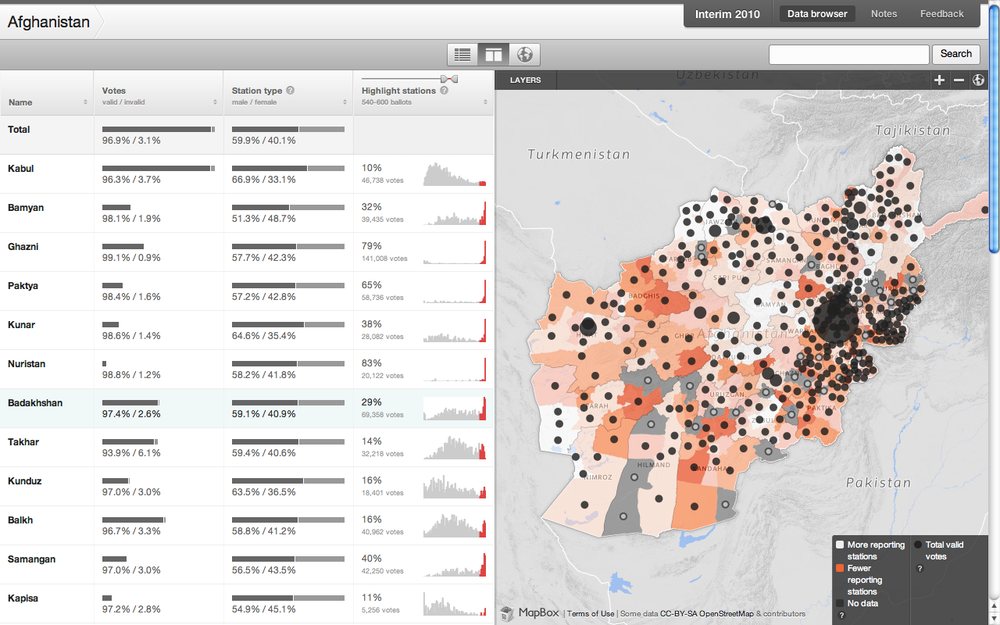
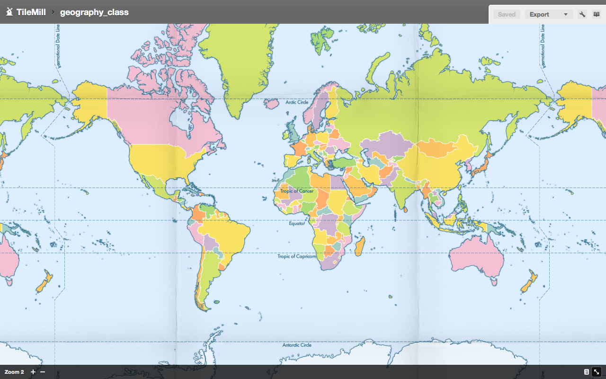
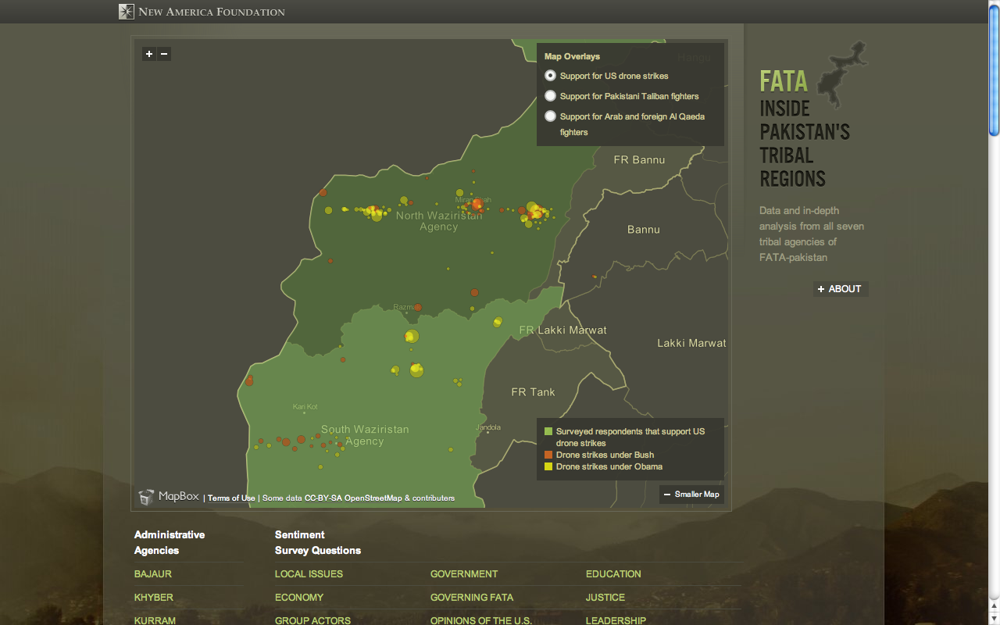
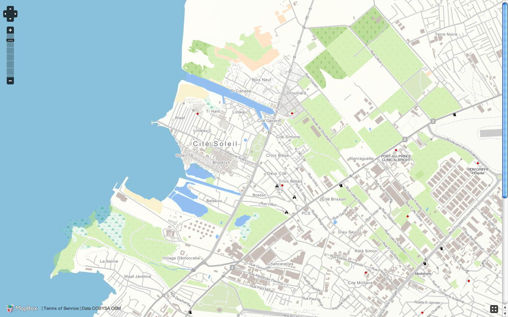
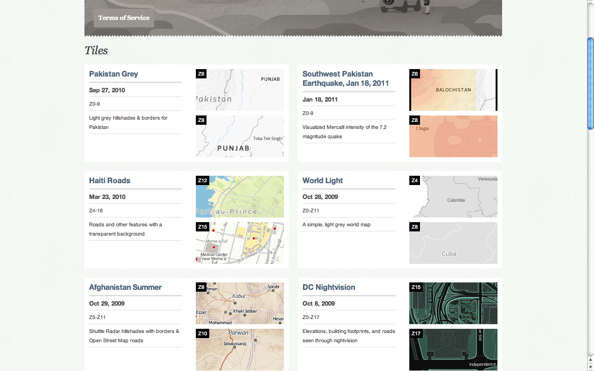
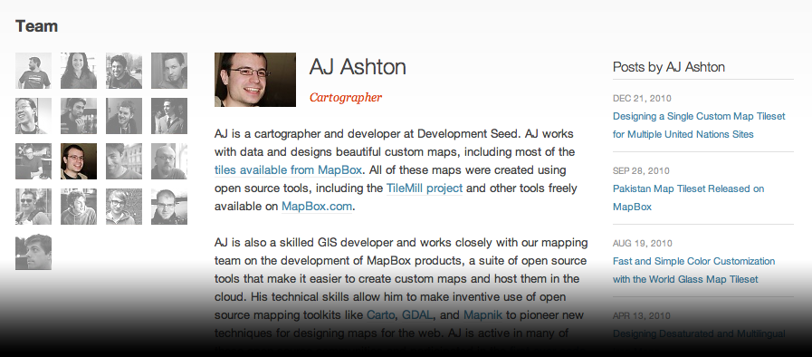
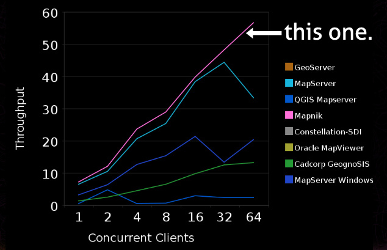
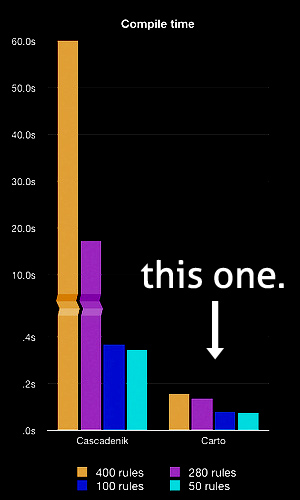

!SLIDE center

!SLIDE center

!SLIDE center

!SLIDE center

!SLIDE center

!SLIDE bullets
* but mapmaking is hard because it's complicated.

!SLIDE center
# beautiful maps even without AJ?

!SLIDE center
* OSM/CSVs -> Shapefiles
* ...
* Cascadenik or Mapnik XML -> TileLite to preview
* ...
* Finished stylesheet -> TileCache to generate tiles
* ...
* Tiles -> S3 to serve tiles
* ...
* S3 -> OpenLayers to view tiles on the web

!SLIDE bullets
* and installing all of that stuff.

!SLIDE center
# we didn't buy: we built

!SLIDE center
# and open source was already awesome

!SLIDE center
### Rendering

!SLIDE center
### Styling

!SLIDE bullets
* plus *node.js*, *backbone.js*, *sqlite*, *openlayers*, *jquery*, *express*, *s3*, *wax*, and more.
* and hot sauce

!SLIDE
# TileMill

!SLIDE bullets
* let's make a map

!SLIDE bullets
* what won't TileMill do?

!SLIDE bullets
# TileMill Will Not Analyze Your Watersheds
* It's a map design tool: QGIS, OGR, and other tools are great for analysis

!SLIDE bullets
# TileMill will not project the world in the shape of a ♥
* For now, it's for the web and keeps things simple.

!SLIDE bullets
# TileMill will not run on Windows
* But you can access it from a Windows computer

!SLIDE bullets
* WMS?

!SLIDE bullets
* Nah.

!SLIDE bullets
* MBTiles
* PNG
* PDF

!SLIDE bullets
# MBTiles

* based on SQLite
* can export to disk (as TMS)
* or host on the web
* or put on an iPad or iPhone

!SLIDE bullets
# try it out.

!SLIDE center

!SLIDE bullets
# Thanks!
* tilemill.com
* `@tmcw`
* `@mapbox`
