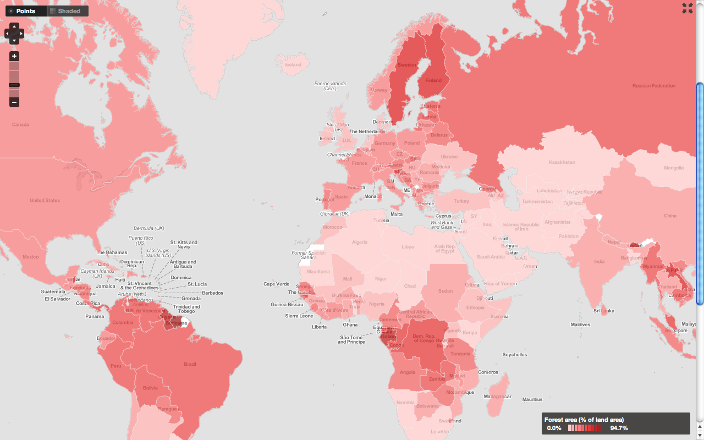

!SLIDE center

!SLIDE center

!SLIDE center

!SLIDE center

!SLIDE
# TileMill

!SLIDE bullets incremental
* It's Open Source
* Don't Be Afraid

!SLIDE bullets
* Ingredients

!SLIDE center
### Mapnik

!SLIDE center
### Carto

!SLIDE center
### Also featuring...

* node.js
* express
* backbone.js
* jquery
* sqlite
* osr
* codemirror
* openlayers
* ...and many others

!SLIDE bullets
# TileMill Will Not

* analyze your watersheds
* project the world in the shape of a ♥
* run on Windows

!SLIDE bullets
# TileMill Will

* make beautiful maps quickly

!SLIDE bullets

* wake up, it's time for a live demo.
